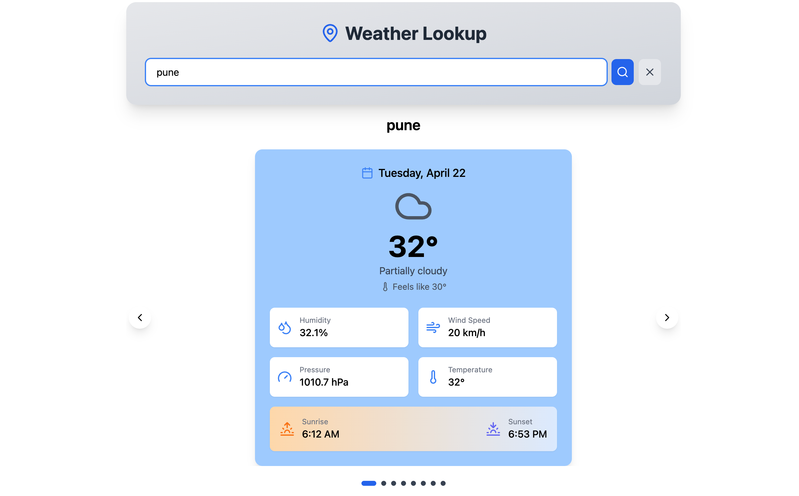

# React Weather API



A modern weather application built with React, TypeScript, and Vite that provides detailed weather forecasts using the Visual Crossing Weather API.

## Features

- **7-Day Weather Forecast**: View detailed weather information for the next 7 days
- **Responsive Design**: Works seamlessly on desktop and mobile devices
- **Detailed Weather Information**: Temperature, humidity, wind speed, pressure, sunrise, and sunset times
- **Clean UI**: Modern and intuitive user interface with smooth animations
- **Error Handling**: Proper error handling and loading states

## Technologies Used

- **React**: Frontend library for building user interfaces
- **TypeScript**: Static typing for JavaScript
- **Vite**: Next-generation frontend tooling
- **Tailwind CSS**: Utility-first CSS framework
- **Keen Slider**: Lightweight touch slider
- **Lucide React**: Beautiful icons
- **Axios**: Promise-based HTTP client
- **Visual Crossing API**: Weather data provider

## Getting Started

### Prerequisites

- Node.js (v14 or higher)
- npm or yarn
- Visual Crossing API key (get one at [Visual Crossing](https://www.visualcrossing.com/))

### Installation

1. Clone the repository:

   ```bash
   git clone https://github.com/yourusername/react-weather-api.git
   cd react-weather-api
   ```

2. Install dependencies:

   ```bash
   npm install
   ```

3. Create a `.env` file in the root directory and add your API key:

   ```env
   VITE_WEATHER_API_KEY=your_visual_crossing_api_key
   ```

4. Start the development server:

   ```bash
   npm run dev
   ```

5. Open your browser and navigate to `http://localhost:5173`

## Project Structure

```text
src/
├── components/       # React components
│   ├── Form.tsx      # Search form component
│   └── Temp.tsx      # Weather display component
├── Context.tsx       # Weather context provider
├── api.tsx           # API service functions
├── App.tsx           # Main application component
├── main.tsx          # Application entry point
└── index.css         # Global styles
```

## Deployment

To build the application for production:

```bash
npm run build
```

The build artifacts will be stored in the `dist/` directory.

## License

This project is licensed under the MIT License - see the LICENSE file for details.

## Acknowledgements

- [Visual Crossing](https://www.visualcrossing.com/) for providing the weather API
- [Tailwind CSS](https://tailwindcss.com/) for the styling framework
- [Lucide React](https://lucide.dev/) for the beautiful icons
- [Keen Slider](https://keen-slider.io/) for the carousel functionality
